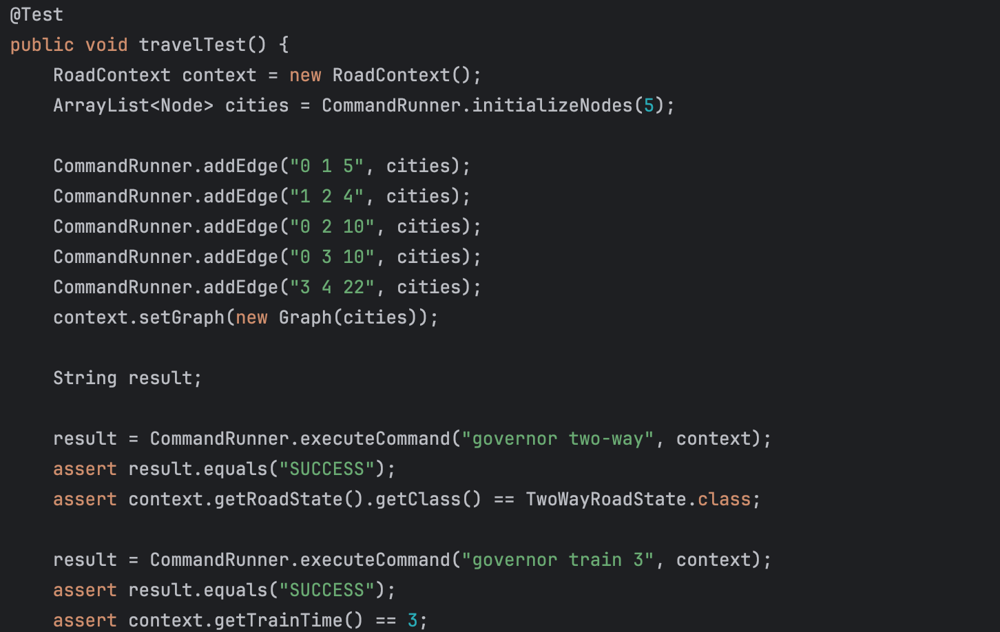

# Experiment-6

<div dir="rtl">

## بخش اول

در این بخش نیازمندی‌های گفته شده را ابتدا طبق رویکرد آزمون‌رانه شروع کردیم. برای این کار ابتدا یک تست نوشتیم که مراحل
گفته شده را انجام می‌دهد:


پس از پیاده‌سازی‌های اولیه‌ی مربوط به ساختن گراف، با استفاده از دو استراتژی گفته شده نیازمندی‌ها را پیاده‌سازی کردیم.
در نهایت نیز برای کنار هم قرار دادن این استراتژی‌ها یک کلاس کمکی `CommandRunner` اضافه کردیم که در نوشتن تابع Main و تست
ها راحت‌تر باشیم.

### الگوی State

هرگاه بخواهیم وضعیتی را نگه داشته و آن را تغییر دهیم، از الگوی State استفاده می‌کنیم.
از این الگو برای پیاده‌سازی مربوط به وضعیت جاده‌ها(یک طرفه یا دوطرفه) استفاده کردیم. در این رویکرد، هربار که state
جاده‌ها تغییر می‌کرد، نیاز داشت که گراف آپدیت کند. این موضوع دقیقا به کمک الگوی state قابل پیاده‌سازی است. بنابراین نیاز
بود تا هر state از یک کلاس abstract به صورت زیر ارثبری کند:

<div dir="ltr">

```java
public abstract class RoadState {
  public abstract void updateContext(RoadContext context);
}
```

<div dir="rtl">

به علاوه در این الگو عمدتا مفهومی به نام context نیز وجود دارد. از این مفهوم برای نگه داشتن وضعیت جاده‌ها، زمان واحد
قطار و همچنین خود گراف استفاده کرده‌ایم.

### الگوی Strategy

هرگاه بخواهیم الگوریتم‌های متفاوتی را برای یک کار یکسان استفاده کنیم، استفاده از الگوریتم استراتژی توصیه می‌شود. در این
جا برای محسابه‌ روش‌های متفاوت رسیدن به مقصد از این استراتژی استفاده کرده‌ایم. در اینجا یک رابط کلی داریم که یک تابع
برای محاسبه دارد و یک مبدا، یک مقصد و یک شهر مورد تنفر می‌گیرد:

<div dir="ltr">

```java
public interface ITravelStrategy {
  Integer calculate(Integer src, Integer dst, Integer hated);
}
```

<div dir="rtl">

با در دست داشتن اینها الگوریتم باید بتواند محاسبات خودش را انجام دهد. بدین ترتیب، هر کدام از روش‌ه‌های ما یعنی قطار و
اتوبوس از این رابط extend می‌کنند و با داشتن context محاسبات خود را که همان bfs و Dijkstra هست انجام می‌دهند.
## بخش دوم

- دو مورد اعمال الگوی Facade: برای کلاس‌های CodeGenerator و Parser، دو کلاس Facade ساخته شد تا اولا پیجیدگی داخل این دو
  کلاس را پنهان کند و دوما یک رابط ساده برای کلاس‌هایی که میخواهند با آن‌ها کار کنند ارايه کند
- یک مورد State/Strategy یا استفاده از Polymorphism به جای شرط:
  در کلاس SymbolType یک پارامتر به Enum ها اضافه شد که VarType مربوط به هر مورد را ذخیره می‌کرد، و همین امر باعث شد که
  شرط‌های switch مختلف از بین بروند و تنها گرفتن مقدار varType انجام شود.
- یک مورد Separate Query From Modifier:
  برای این مورد در کلاس Memory، به جای توابع get قبلی، دو تابع جدید نوشته شده اند، که یکی وظیفه‌اش تنها get کردن و دیگری
  increment کردن است.
  نام توابع incrementTemp و incrementDataAddress است (دو مورد دیگر همان اسم قبلی را دارند.)
- یک مورد Self Encapsulated Field: در کلاس‌های Address، Parser و Rule این مورد انجام شده است (setter و getter)
- دو مورد مختلف غیر از بازآرایی‌های مطرح‌شده در موارد بالا: دو مورد تابع extract شده اند (doShiftAction و doReduceAction).
و مورد دوم اینکه مقدار scanner در کلاس Main استخراج شده و در یک متغیر قرار گرفته است.

## بخش سوم

### سوال ۱
در این کتاب ۳ نوع الگوی طراحی وجود دارد: 
  - الگوی طراحی ساختنی: این نوع الگو‌ها مربوط به ساختن نمونه‌های جدید از اشیا هستند. به عبارتی دیگر دغدغه نمونه‌سازی را از منطق کد جدا می‌کنند و قابلیت استفاده مجدد را با سادگی بیشتر فراهم می‌کنند.
  - الگو‌ی طراحی ساختاری: این دسته الگو‌ها کمک می‌کنند که کلاس‌ها و اشیا را در ساختارها و مجموعه‌های بزرگتر با یکدیگر ترکیب کنیم. در اصل این الگو‌ها این کمک را به ما می‌کنند که هنگامی که نیازمند تغییر یا گسترشی در پیاده‌سازی‌های خود داشتیم، به نحوی کد نوشته‌شده باشد که صرفا اجزایی که نیاز است را تغییر دهیم.
  - الگو‌ی طراحی رفتاری: این نوع الگو‌ها مشخص می‌کنند که اشیا مختلف در سیستم چگونه با یکدیگر در تعامل باشند و در کنار یکدیگر رفتار کنند. در عمل اینکه چگونه مسئولیت‌ها را به یکدیگر منتقل کنند و جریان‌های پیچیده‌ی فرایند‌ها را بشکنند و ساده‌سازی کنند.

### سوال ۲
هر دوی الگو‌های طراحی استفاده‌شده در این فاز، یعنی state و strategy از نوع رفتاری یا behavioral هستند.
در عمل می‌توان به این صورت توضیح داد که الگوی state اجازه می‌دهد که یک شی رفتار خودش را با توجه به وضعیتی که در آن قرار دارد تغییر دهد.
از طرفی، الگوی یک مجموعه‌ای از رفتار‌ها و الگوریتم‌های متنوع برای انجام دادن یک کار بخصوص را پیاده‌سازی می‌کنند و وابسته به اینکه در چه شرایطی هستیم، یکی از این الگوریتم‌ها انتخاب‌شده و در زمان اجرا، عمل می‌کند.
 بنابراین، می‌توان گفت که این دو الگو در زمره‌ی الگو‌های رفتاری قرار می‌گیرند.

### سوال ۳
عملا عبارت حالت در صورت سوال هم این موضوع را تداعی می‌کند که ما درگیر با وضعیت‌های مختلفی از سیستم هستیم. یعنی یک حالت از سیستم این است که یال‌ها دوطرفه باشند و حالت دیگر این است که یا‌ل‌ها همگی یک‌طرفه باشند. در عمل می‌توانیم از الگوی State برای پیاده‌سازی این نیازمندی استفاده کنیم. به این صورت که یک واسط به نام State در نظر می‌گیریم که در آن یک تابع داریم به نام calculateJourneyTime و این یک رفتاری است که در هر کدام از استیت‌های سیستم خود انتظار داریم که بتوانیم بروز دهیم. نوع پیاده‌سازی این رفتار، اما، در حالت‌های مختلف متفاوت خواهد بود. بنابراین، لازم است که دو پیاده‌سازی برای این رابط داشته باشیم. یکی Bidirectional (دوطرفه) ‌و دیگری Unidirectional (یک طرفه). در نهایت یک متغیر به نام وضعیت باید در کلاس اصلی سرویس خود داشته باشیم (مثلا می‌تواند یک کلاس GraphService باشد). این گراف عملیات محاسبه فاصله زمانی یک سفر از شهر A به B را به واسط State واگذاری می‌کند. در هر لحظه، در زمان اجرا، ما قطعا در یکی از دو حالت یک‌طرفه یا دوطرفه هستیم، بنابر‌این هنگامی که state.calculateJourneyTime(A, B) را صدا بزنیم آن حالتی از سیستم که در آن هستیم رفتار متناسب را بروز می‌دهد. همانطور که این متغیر را برای GraphService خود در نظر گرفتیم، باید یک متد برای تغییر وضعیت هم داشته باشیم که با ورودی گرفتتن وضعیت جدید، مقدار state درونی را به درستی ست کند. (مثلا changeState(state))

### سوال ۴
- Open/Closed Principle:  این مورد به طور خاص تحقق نیافته است چرا که در عمل ما در الگوی Singleton به هنگام دسترسی به نمونه‌های یک کلاس خاص همواره یک نمونه از پیش ساخته‌شده را باز می‌گردانیم. به طور دقیقتر ما عملا نمی‌توانیم رابطه is-a با کلاس فرزندی برقرار کنیم و همزمان این امکان را داشته باشیم که نمونه‌های جدیدی از آن فرزند گرفته شود (چرا که تنها نمونه ممکن همان نمونه موجود از کلاس پدر است) (<a href="https://belatrix.globant.com/us-en/blog/tech-trends/the-singleton-design-pattern/#:~:text=The%20Singleton%20pattern%20can%20be,regarded%20as%20an%20Anti%2DPattern.">منبع</a>) (<a href="https://stackoverflow.com/questions/36887344/why-singleton-breaks-open-closed-principle">منبع</a>)
- Single Responsibility: این اصل هم دارد نقض می‌شود. در عمل الگوی Singleton دارد هم نمونه‌سازی یک کلاس را انجام می‌دهد و هم نگهداری یک دسترسی همگانی و گلوبال به یک متغیر، طوری که می‌توان آن را از هر جایی تغییر داد.  (<a href="https://refactoring.guru/design-patterns/singleton">منبع</a>) (<a href="https://belatrix.globant.com/us-en/blog/tech-trends/the-singleton-design-pattern/#:~:text=The%20Singleton%20pattern%20can%20be,regarded%20as%20an%20Anti%2DPattern.">منبع ۲</a>)
- Dependency Inversion: این اصل هم دارد نقض می‌شود. در عمل، مصرف‌کنندگان یک کلاس به همان نوع خاص از کلاس وابسته می‌شوند و عملا انعطاف‌پذیری در پیاده‌سازی کاهش یابد. (<a href="https://stackoverflow.com/questions/36887344/why-singleton-breaks-open-closed-principle">منبع</a>)

### سوال ۵
- کد تمیز: کدی که به راحتی قابل خواندن و نگهداری است، منطق ساده‌ای داد که مجموع این ویژگی‌ها این اجازه را به ما می‌‌دهد که به مرور زمان کدی منعطف در برابر تغییر داشته باشیم.
- کیفیت کد یک ارزش در یک پروژه نرم‌افزاری محسوب می‌شود، بدهی فنی عملا مشخص می‌کند که به دلیل مبادلاتی که بین خوبی‌ها و بدی‌های راه‌حل‌های مختلف انجام می‌دهیم گاهی مجبور می‌شویم یک روشی را انتخاب کنیم که در آینده نیاز به کار مجدد و اصلاح آن را خواهیم داشت تا به آن سطح از کیفیت مطلوب برسیم.
- به الگوهای اغلب رایجی گفته می‌شود که در کد ممکن است مشاهده شوند و به طور مستقیم باگ یا خطای برنامه‌نویسی نیستند ولی نقض‌کننده اصول طراحی یا توسعه هستند و به مرور زمان کیفیت کد را پایین می‌آورند.

### سوال ۶
- Bloater: این دسته از بو‌های بد به کلاس‌ها، متد‌ها و به طور کلی قطعاتی از کد گفته می‌شود که به صورت تدریجی بزرگ می‌شوند و گستره‌ی بزرگی از وظایف را در خود جای می‌دهند.
- Object-Orientation Abusers: این نوع بوهای بد به دلیل استفاده‌های ناصحیح یا ناقص از الگوهای شی‌گرایی ایجاد می‌شوند
- Change Preventers: این بوهای بد زمانی خود را به طور جدی‌تر نشان می‌دهند که بخواهیم تغییری در منطق برنامه خود ایجاد کنی. عمدتا مجبورمان می‌کنند که تغییرات زیادی را در جاهیا مختلف انجام دهیم.
- Dispensables: مواردی که به آن‌ها نیازی نیست و با حذف شدنشان از پیچیدگی مضاعف کد کاسته می‌شود و فابلیت فهم آن بالاتر می‌رود.
- Couplers: این دسته از بوهای بد در عمل coupling را در کد بالا می‌برند به این معنا که وابستگی‌های بی‌دلیل بین کلاس‌های مختلف ایجاد می‌کنند که انعطاف‌پذیری کد را پایین می‌آورند.

### سوال ۷
بوی بد Lazy Class جز بوهای بد از نوع Dispensables است. برای رفع این بوی بد می‌توان از دو روش استفاده کرد.
- یکی اینکه سعی کنیم ساختار موجود در کد را فشرده‌تر کنیم به این معنا که superclassها و subclassها را در یکدیگر ادغام کنیم. این راه در مواقعی به درد می‌خورد که به اصطلاح با توجه به اسکوپب فعلی برنامه over-engineering رخ داده است و به خصوص وقتی که به مرور زمان کلاس‌های فرزند و والد بسیار شبیه به یکدیگر می‌شوند.
- مورد دوم این است که فیچر‌ها و ویژگی‌های یک کلاس را که ماهیت و حضور مستقل ندارد را به کلاسی دیگر منتقل کنیم. در اصل گاهی، ما یک کلاس داریم که مسئولیت خاصی برعهده ندارند. در این مواقع می‌توانیم فیلد‌ها و ویژگی‌های آن کلاس را به کلاس‌های بامعنای دیگر منتقل کنیم.
گاهی اوقات ممکن است که ساختار‌‌های پیچیده در کد یا عناصری به ظاهر بیهوده و اصطلاحا Lazy به نظر برسند، اما برای آن‌ها نقش مهمی در ادامه توسعه سیستم ما وجود داشته باشد. در این مواقع این smell بهتر است نادیده گرفته شود در عین اینکه سعی شود تناسب و اعتدالی میان سادگی و شفافیت کد رعایت شود.
<a href="https://refactoring.guru/smells/lazy-class">منبع</a>

### سوال ۹
این پلاگین کمک می‌کند برخی استاندارد‌های ظاهری در سورس کد ما رعایت شده باشد. به عنوان مثال، تورفتگی‌ها، فاصله‌ها و چینش کد به خوبی و به صورت هماهنگ در کد شکل بگیرد. در نهایت، با استفاده از این پلاگین می‌توان خوانایی و تمیزی کد را بالا برد. به صورت غیر مستقیم این باعث افزایش کیفیت کد، کاهش احتمال خطا و به طور کلی نگهداری‌پذیری بیشتر کد با گذشت زمان می‌شود. در گام اول بازآرایی، در پروژه آزمایشگاه ذکر‌شده که می‌توان پس از انجام بازآرایی از این پلاگین استفاده کرد، به عبارتی دیگر به عنوانی گامی نهایی برای بازآرایی ظاهری می‌توانیم از این افزونه استفاده کنیم. البته به نظرم، استفاده از این افزونه پیش از بازآرایی هم از جنبه‌ای، با آشکارتر کردن ساختار کد و نشان دادن بهتر نقص‌های آن، می‌تواند بسیار مفید واقع شود. 
</div>
